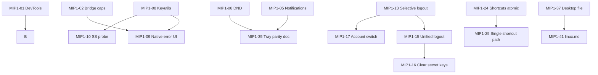

# Maturity Improvement Plan 1

**Branch:** `maturity_improvement_plan1`  
**Status:** Phase 4 — Holistic review complete (merge blocked on manual smoke + user review)  
**Scope:** macOS + Linux Synara Desktop (Tauri shell + `synara/` runtime)  
**Process:** `mip1-00` (plan) + 46 implementation commits (`mip1-01`…`mip1-46`), one item per commit  
**Reviewed:** 2026-06-10

---

## Executive Overview

This plan converts the desktop maturity review into 46 independently committable work items. Each item has explicit requirements, measurable acceptance criteria, and tests where applicable. Items are grouped into nine implementation waves (A–I) that respect dependencies.

### Prerequisites Already Landed on `main` (pre-MIP1)

These concerns from our discussion are **not** duplicated as MIP1 items because they are already implemented on `main` before this branch:

| Concern | Resolution on `main` |
|---------|----------------------|
| Rust `dead_code` warning (macOS keychain constant) | `#[allow(dead_code)]` added |
| Tauri CLI/API vs Rust crate version skew | `@tauri-apps/cli` + `api` → 2.10.1; `tauri` pinned 2.10 |
| `__TAURI_BUNDLE_TYPE` bundler warning | Addressed by version alignment |
| Account/device crypto store mismatch on re-login | `matrixLocalStores.ts` + init retry + logout cleanup |
| Version numbering tooling | `bump-version.mjs`, enhanced `check:versions` (iOS build # reporting) |

MIP1 branch should merge/rebase from current `main` before Wave A implementation.

### Global Non-Functional Requirements (all items)

| NFR | Requirement |
|-----|-------------|
| **G-NFR-1** | No secrets (tokens, recovery keys, session JSON) in logs, errors shown to users, or test fixtures |
| **G-NFR-2** | macOS and Linux behavior must remain functional after each commit; CI checks that exist today must pass |
| **G-NFR-3** | Public Tauri IPC command signatures remain backward-compatible unless the item explicitly documents a breaking change |
| **G-NFR-4** | New Rust code follows existing `desktop.rs` sanitization and error-string patterns |
| **G-NFR-5** | New TypeScript follows existing `synara/` test patterns (`node:test` + esbuild bundle via `test:modernization`) |
| **G-NFR-6** | Every implementation commit passes minimum gate: `npm run check:versions` (if versions touched), `npm run test:modernization` (if TS touched), `cargo test` + `cargo check` (if Rust touched) |

### Global Success Metrics (program-level)

| Metric | Target |
|--------|--------|
| AC pass rate | 46/46 items pass orchestrator review with zero Critical/High open issues |
| Test regression | `npm run check:versions`, `npm run test:modernization`, `cargo test`, `cargo check --locked` pass on branch tip |
| Commit hygiene | Exactly 47 commits on branch: `mip1-00` (plan) + `mip1-01`…`mip1-46` (one per item), in implementation sequence order |
| Documentation | Plan self-review and final holistic review recorded in branch history |

### Commit Convention

```
mip1-NN: <imperative title ≤72 chars>

<body: what changed, why, tests run>
```

---

## Implementation Waves

| Wave | Theme | Items | Rationale |
|------|-------|-------|-----------|
| **A** | Security & trust boundaries | 4, 5, 13, 46 | Reduce attack surface before feature work |
| **B** | Broken native UX (notifications, tray, agents) | 1, 2, 3 | Highest user-visible correctness gaps |
| **C** | Secret store truthfulness | 6, 14, 15, 16, 17 | Session persistence reliability on Linux/macOS |
| **D** | Session lifecycle & logout | 7, 12, 27, 28, 30 | Coherent auth/logout without data loss |
| **E** | Performance & memory | 8, 9, 10, 20, 41, 42 | Desktop responsiveness under load |
| **F** | Rust shell hardening | 11, 18, 19, 21, 22, 23 | Shortcut, port, URL, badge robustness |
| **G** | Frontend resilience & UX clarity | 24, 25, 26, 29 | Error visibility and sync feedback |
| **H** | Platform parity & packaging | 31, 32, 33, 34, 35, 36 | Linux packaging and cross-platform consistency |
| **I** | Polish, docs, long-term | 37, 38, 39, 40, 43, 44, 45 | Maintainability and release readiness |

---

## Item Specifications

### Wave A — Security & Trust Boundaries

---

#### MIP1-01 (Item 4) — Gate DevTools to debug builds only

**Priority:** P0  
**Files:** `src-tauri/Cargo.toml`, `src-tauri/capabilities/main.json`, `src-tauri/src/lib.rs` (if feature-gated)

**Requirements**
- R-01: `devtools` Tauri feature enabled only when a `debug` or `devtools` Cargo feature is active
- R-02: Release/default builds must not expose `internal_toggle_devtools` to the main webview
- R-03: Debug/dev workflow (`tauri dev`) retains DevTools access

**Acceptance Criteria**
- **AC-01:** Given a `--release` build, when the webview attempts to toggle DevTools, then the capability is denied
- **AC-02:** Given `cargo tauri dev`, when a developer opens DevTools, then it works as today
- **AC-03:** Given `cargo check --release`, then the build completes without the `devtools` feature

**Tests**
- T-01: `cargo check --release` in CI-equivalent mode
- T-02: Manual: release binary cannot open DevTools via documented shortcut (record in validation notes)

**Dependencies:** None  
**Risks:** Accidentally breaking `tauri dev` — mitigate with explicit feature split  
**Success metric:** Release `Cargo.toml` features list excludes `devtools`

---

#### MIP1-02 (Item 5) — Runtime-accurate desktop bridge capabilities

**Priority:** P0  
**Files:** `src-tauri/src/desktop_bridge.js`, `src-tauri/src/lib.rs`, `synara/src/app/platform/capabilities.ts`, `synara/src/app/platform/secrets.ts`

**Requirements**
- R-01: Bridge must not hardcode `supportsSecureSecretStore: true`
- R-02: Initial bridge flags reflect conservative defaults; real status comes from `desktop_get_integration_status` / `desktop_secret_store_status` before advertising persistence
- R-03: Settings UI must not show “secure store available” when `can_persist_session` is false

**Acceptance Criteria**
- **AC-01:** Given Linux without Secret Service, when capabilities load, then `supportsSecureSecretStore` is false
- **AC-02:** Given macOS with Keychain, when status probe succeeds, then secure store is advertised true
- **AC-03:** Given bridge injection before first IPC, when defaults are read, then no capability overclaims persistence

**Tests**
- T-01: Extend `synara/src/app/platform/__tests__/platform.test.ts` for false-by-default bridge
- T-02: Rust unit test for status → bridge flag mapping (if bridge becomes dynamic)

**Dependencies:** Complements MIP1-08, MIP1-09  
**Risks:** Race on first paint — mitigate with loading state in settings until `desktop_secret_store_status` resolves

---

#### MIP1-03 (Item 13) — Tighten Content-Security-Policy

**Priority:** P0  
**Files:** `src-tauri/tauri.conf.json`, `docs/desktop-matrix-sdk-boundaries.md` (exception list only)

**Requirements**
- R-01: Document every CSP exception with Matrix/federation justification
- R-02: Remove unnecessary wildcards where Synara functions without them (e.g. tighten `frame-src` if Element Call path allows)
- R-03: Keep federation, media, calls, and worker requirements functional on macOS and Linux smoke paths

**Acceptance Criteria**
- **AC-01:** Given a standard login + room + image + call smoke path, when exercised on desktop, then no CSP violations block features
- **AC-02:** Given the updated CSP string, when compared to prior, then at least one wildcard category is narrowed OR documented as required with evidence
- **AC-03:** Given `npm run tauri build`, then bundling succeeds

**Tests**
- T-01: Manual smoke checklist (login, room timeline, image, notification, external link)
- T-02: Optional: automated CSP diff test in `scripts/check-matrix-boundaries.mjs` if applicable

**Dependencies:** None  
**Risks:** Breaking Element Call embed — test call route explicitly  
**Trade-off:** Full strict CSP may be impossible with Matrix federation; document residual risk

---

#### MIP1-04 (Item 46) — Windows session storage: disable honestly or implement

**Priority:** P3 (out of macOS/Linux scope unless Windows shipping)  
**Files:** `src-tauri/Cargo.toml`, `src-tauri/src/desktop.rs`, `synara/src/app/platform/capabilities.ts`, `README.md`

**Requirements**
- R-01: Choose **Option A** (recommended for this branch): explicitly document Windows as unsupported for native session persistence and ensure UI reflects it
- R-02: **Option B** (only if Windows release planned): add `windows-native` keyring feature and Windows status probe
- R-03: No silent fallback that implies Keychain-equivalent security on Windows

**Acceptance Criteria**
- **AC-01:** Given `target_os = windows` build docs, when a user reads README/capabilities, then persistence limitations are explicit
- **AC-02:** Given Option B chosen, when Windows build runs, then `can_persist_session` can be true with tests

**Tests**
- T-01: `#[cfg(target_os = "windows")]` unit tests if Option B
- T-02: Capability documentation test / snapshot

**Dependencies:** MIP1-02  
**Risks:** Scope creep — default to Option A for this branch  
**Decision:** **Option A** unless product direction changes before merge

---

### Wave B — Broken Native UX

---

#### MIP1-05 (Item 1) — Notification click navigates to sanitized route

**Priority:** P0  
**Files:** `src-tauri/src/desktop.rs`, `synara/src/app/utils/desktop.ts`, `synara/src/app/pages/client/ClientNonUIFeatures.tsx`, `tauri-plugin-notification` integration

**Requirements**
- R-01: `desktop_notify` must register a click handler that calls `navigate_main_window` with sanitized `route`
- R-02: Frontend must pass `route` for message, Later, and agent-approval desktop notifications
- R-03: Routes must pass existing `sanitize_notification_route` / navigation guards

**Acceptance Criteria**
- **AC-01:** Given a desktop notification with `route: "room/!abc:server"`, when the user clicks it, then the main window focuses and navigates to that route
- **AC-02:** Given an unsafe route in payload, when notify is invoked, then request is rejected with stable error (no navigation)
- **AC-03:** Given Linux, when notification clicked, then main window focuses and navigates
- **AC-04:** Given macOS, when notification clicked, then equivalent navigation occurs via platform-supported click API (or documented limitation with fallback deep-link via tray)

**Tests**
- T-01: Rust unit tests for route attachment + sanitization rejection
- T-02: TS unit test for notification payload including route on all desktop notification call sites
- T-03: Manual Linux smoke: click notification → correct room
- T-04: Manual macOS smoke: click notification → correct room (or documented gap filed as follow-up)

**Dependencies:** None  
**Risks:** `tauri-plugin-notification` click API differs per OS — implement per-platform handler module with shared `navigate_main_window` core

---

#### MIP1-06 (Item 2) — Tray Do Not Disturb toggle works

**Priority:** P0  
**Files:** `src-tauri/src/desktop.rs`, `synara/src/app/pages/client/ClientNonUIFeatures.tsx` or settings state, tray update path

**Requirements**
- R-01: `MENU_DND_TOGGLE` must toggle DND state in app-coordinated store (frontend authority or shared Rust state with event)
- R-02: Tray menu label must reflect current DND state after toggle
- R-03: DND state must affect notification dispatch (existing logic wired)

**Acceptance Criteria**
- **AC-01:** Given DND off, when user clicks tray DND item, then DND becomes on and label updates
- **AC-02:** Given DND on, when user clicks again, then DND becomes off
- **AC-03:** Given DND on, when a message arrives, then desktop notification is suppressed per existing rules

**Tests**
- T-01: Rust test for menu handler emitting toggle event
- T-02: TS test for DND state flip via tray event listener
- T-03: Manual Linux tray smoke

**Dependencies:** None  
**Risks:** macOS tray may lack DND item today — document parity gap or add macOS item (see MIP1-31)

---

#### MIP1-07 (Item 3) — Frontend listens for `synara://agent-action`

**Priority:** P0  
**Files:** `synara/src/app/platform/` or `ClientNonUIFeatures.tsx`, `src-tauri/src/desktop.rs`

**Requirements**
- R-01: Register Tauri event listener for `synara://agent-action` at client boot
- R-02: Payload must be validated against agent-action contract before execution
- R-03: Handler must invoke existing agent action execution path (same as in-app)

**Acceptance Criteria**
- **AC-01:** Given Rust emits `synara://agent-action` with valid payload, when client is running, then action executes
- **AC-02:** Given invalid payload, when event received, then it is rejected without side effects
- **AC-03:** Given no listener regression, when searching codebase, then `listen('synara://agent-action')` exists

**Tests**
- T-01: TS unit test with mocked `listen` + handler
- T-02: Contract schema validation test reusing `synara-agent-action.schema.json`

**Dependencies:** None  
**Risks:** Duplicate handling if both tray and web fire — idempotency key on action id

---

### Wave C — Secret Store Truthfulness

---

#### MIP1-08 (Item 6) — Fix Linux keyutils detection false positive

**Priority:** P0  
**Files:** `src-tauri/src/desktop.rs`

**Requirements**
- R-01: Remove `/proc/keys` existence as sole/key signal of usable keyutils persistence
- R-02: Detection must attempt a non-destructive keyring probe OR return unavailable when only session-scoped ephemeral storage is possible
- R-03: `linux_secret_store_status_from_signals` must not prefer keyutils over accurate unavailable

**Acceptance Criteria**
- **AC-01:** Given standard Linux without Secret Service and without configured persistent keyutils, when status is queried, then `can_persist_session` is false
- **AC-02:** Given mocked successful keyring round-trip test, when probe passes, then keyutils backend may be reported
- **AC-03:** Given existing Secret Service, when both present, then Secret Service preferred

**Tests**
- T-01: Update `desktop.rs` unit tests for `has_linux_keyutils_backend` / status aggregation
- T-02: `cargo test` in `src-tauri`

**Dependencies:** None  
**Risks:** Probe side effects — use dry-run or test key name

---

#### MIP1-09 (Item 14) — Surface `nativeStoreError` in Settings UI

**Priority:** P1  
**Files:** `synara/src/app/features/settings/general/General.tsx`, `synara/src/app/state/sessionBootstrap.ts`

**Requirements**
- R-01: When bootstrap/persistence sets `nativeStoreError`, settings secret-store section shows warning
- R-02: Warning must explain fallback to legacy storage without exposing tokens
- R-03: Warning clears when native store succeeds on retry/migration

**Acceptance Criteria**
- **AC-01:** Given native store throws on getSession, when settings open, then warning visible
- **AC-02:** Given successful native migration, when settings open, then warning absent
- **AC-03:** Given web-only build, when settings open, then no misleading native warning

**Tests**
- T-01: Extend `sessionPersistence.test.ts` + settings component test if feasible
- T-02: Manual screenshot-less DOM assertion via unit test mock

**Dependencies:** MIP1-02, MIP1-08  
**Risks:** None

---

#### MIP1-10 (Item 15) — Live Secret Service probe

**Priority:** P2  
**Files:** `src-tauri/src/desktop.rs`

**Requirements**
- R-01: Replace or supplement dbus service-file heuristic with keyring read/write probe
- R-02: Probe result must map to `DesktopSecretStoreStatus` reason codes
- R-03: Probe must complete within 2s or fail gracefully

**Acceptance Criteria**
- **AC-01:** Given Secret Service running, when probed, then `linux-secret-service` with `can_persist_session: true`
- **AC-02:** Given service file present but daemon stopped, when probed, then unavailable with explicit reason
- **AC-03:** Given Flatpak/sandbox without secret service, when probed, then does not false-positive from file scan alone

**Tests**
- T-01: Unit tests with injected/mock probe trait
- T-02: CI-safe tests do not require live dbus (mocked)

**Dependencies:** MIP1-08  
**Risks:** CI without dbus — mandatory mock abstraction

---

#### MIP1-11 (Item 16) — macOS Keychain probe

**Priority:** P2  
**Files:** `src-tauri/src/desktop.rs`

**Requirements**
- R-01: macOS `platform_secret_store_status` must not unconditionally return available
- R-02: Lazy probe on first session operation OR lightweight startup probe
- R-03: Locked keychain / denied ACL returns distinct reason

**Acceptance Criteria**
- **AC-01:** Given keychain accessible, when status queried, then available true
- **AC-02:** Given simulated keyring failure, when status queried, then available false with reason
- **AC-03:** Given non-macOS build, when compiled, then macOS-only code cfg-gated

**Tests**
- T-01: macOS-target unit tests with mock keyring backend (or `#[cfg(test)]` injection)
- T-02: Linux CI compiles without macOS-only deps leaking

**Dependencies:** None  
**Risks:** Keychain prompts on probe — use non-interactive test account

---

#### MIP1-12 (Item 17) — Structured secret-store error reporting

**Priority:** P2  
**Files:** `src-tauri/src/desktop.rs`

**Requirements**
- R-01: Replace single `desktop-secret-store-operation-failed` with stable public codes (e.g. `locked`, `unavailable`, `denied`)
- R-02: Full error detail logged via `log`/`tracing` server-side only, never in IPC strings
- R-03: Existing tests asserting no token echo remain passing

**Acceptance Criteria**
- **AC-01:** Given keychain locked mock, when set_session fails, then IPC returns `desktop-secret-store-locked` (or documented code)
- **AC-02:** Given any failure, when error returned to webview, then string contains no access token substring
- **AC-03:** Given debug build, when server log captured, then structured reason present

**Tests**
- T-01: Extend `desktop.rs` secret store tests for error code mapping
- T-02: Red-team test: error messages never contain session JSON

**Dependencies:** MIP1-10, MIP1-11  
**Risks:** Frontend must handle new codes — update TS types

---

### Wave D — Session Lifecycle & Logout

---

#### MIP1-13 (Item 7) — Selective logout: preserve user settings

**Priority:** P1  
**Files:** `synara/src/client/initMatrix.ts`, `synara/src/app/pages/client/ClientRoot.tsx`, `synara/src/app/state/sessions.ts`

**Requirements**
- R-01: Remove `localStorage.clear()` from logout paths
- R-02: Remove only session keys (`synara_*` fallback keys) and documented session-related entries
- R-03: Settings atoms (theme, zoom, shortcuts prefs) survive logout+reload

**Acceptance Criteria**
- **AC-01:** Given user sets non-default theme, when logout completes, then theme persists after reload
- **AC-02:** Given logged-in session, when logout completes, then session keys are gone
- **AC-03:** Given forced `SessionLoggedOut`, when handler runs, then same selective clearing applies

**Tests**
- T-01: Unit test: `clearLoginData` removes session keys only (mock localStorage)
- T-02: Extend `sessionPersistence.test.ts`

**Dependencies:** MIP1-14  
**Risks:** Missing a session key — maintain central key list in `sessions.ts`

---

#### MIP1-14 (Item 12) — Push session to service worker after login

**Priority:** P1  
**Files:** `synara/src/app/pages/auth/login/loginUtil.ts`, `synara/src/index.tsx`, `synara/src/sw-session.ts`

**Requirements**
- R-01: Call `pushSessionToSW()` after successful `persistAuthenticatedSession`
- R-02: SW must receive credentials needed for authenticated media fetch
- R-03: No duplicate push storms on every navigation

**Acceptance Criteria**
- **AC-01:** Given fresh login without full page reload, when authenticated media is requested, then SW fetch succeeds
- **AC-02:** Given logout, when `pushSessionToSW` runs, then SW session cleared (existing behavior kept)
- **AC-03:** Given login flow unit test, when persist succeeds, then push invoked once

**Tests**
- T-01: Unit test mocking `pushSessionToSW` from login util
- T-02: Manual: login → open attachment without manual reload

**Dependencies:** None  
**Risks:** SW not registered in dev — guard with feature detection

---

#### MIP1-15 (Item 27) — Unify logout code paths

**Priority:** P2  
**Files:** `synara/src/client/initMatrix.ts`, `synara/src/app/pages/client/ClientRoot.tsx`

**Requirements**
- R-01: Extract single `performLogout(mx?)` used by tray, dialog, and `SessionLoggedOut`
- R-02: All paths: stop client, clear persisted sessions, clear matrix local stores, SW push, selective localStorage, reload
- R-03: Optional server `mx.logout()` when client instance exists

**Acceptance Criteria**
- **AC-01:** Given `SessionLoggedOut` event, when handled, then same side effects as tray logout
- **AC-02:** Given logout without `mx`, when tray logout before init, then cleanup still succeeds
- **AC-03:** Given code search, when looking for `localStorage.clear`, then zero occurrences in logout paths

**Tests**
- T-01: Unit tests for shared logout helper with mocked dependencies
- T-02: Regression test ensuring SW push called in both paths

**Dependencies:** MIP1-13  
**Risks:** None

---

#### MIP1-16 (Item 28) — Clear secret storage keys on logout

**Priority:** P2  
**Files:** `synara/src/client/secretStorageKeys.js`, `synara/src/client/initMatrix.ts`

**Requirements**
- R-01: Export and call `clearSecretStorageKeys()` during unified logout
- R-02: In-memory crypto callback map empty after logout
- R-03: Re-login repopulates keys through normal verification flow

**Acceptance Criteria**
- **AC-01:** Given keys cached, when logout runs, then map size 0
- **AC-02:** Given re-login, when client inits, then keys re-requested as needed

**Tests**
- T-01: Unit test for clear function idempotency

**Dependencies:** MIP1-15  
**Risks:** None

---

#### MIP1-17 (Item 30) — Account switch safety for fixed IndexedDB names

**Priority:** P2  
**Files:** `synara/src/client/initMatrix.ts`, `synara/src/app/state/sessionPersistence.ts`

**Requirements**
- R-01: On login when `userId` or `deviceId` differs from last bootstrapped session, clear matrix local stores before init
- R-02: Track last persisted identity in session metadata (non-secret)
- R-03: Document single-account assumption in code comment; multi-account remains non-goal

**Acceptance Criteria**
- **AC-01:** Given user A logged out and user B logs in, when client inits, then no crypto mismatch error surfaced to user
- **AC-02:** Given same user/device re-login, when client inits, then stores not unnecessarily wiped
- **AC-03:** Given mismatch recovery path, when triggered, then still works as fallback

**Tests**
- T-01: Unit test identity comparison logic
- T-02: Integration with existing `isCryptoAccountMismatchError` tests

**Dependencies:** MIP1-13  
**Risks:** Over-clearing — only clear on identity change

---

### Wave E — Performance & Memory

---

#### MIP1-18 (Item 8) — Incremental timeline row building

**Priority:** P1  
**Files:** `synara/src/app/features/room/RoomTimeline.tsx`, `synara/src/app/utils/timelineVirtualization.ts`

**Requirements**
- R-01: Avoid full `buildTimelineRows()` over all linked timelines on every micro-update when possible
- R-02: Preserve virtual anchor, live-end pin, and pagination semantics (existing tests must pass)
- R-03: Measurable improvement: single new message append does not walk entire history

**Acceptance Criteria**
- **AC-01:** Given room with ≥5,000 events (harness fixture), when one message appends at live end, then instrumented `buildTimelineRows` visits ≤10% of events compared to baseline full-scan (baseline captured before change in same harness)
- **AC-02:** Given existing `timelineVirtualization.test.ts`, when run, then all pass
- **AC-03:** Given jump-to-unread and pagination, when exercised, then behavior unchanged

**Tests**
- T-01: Existing virtualization test suite
- T-02: New perf harness or instrumented unit test counting `buildTimelineRows` invocations / nodes visited
- T-03: `npm run test:timeline-performance` if applicable

**Dependencies:** None  
**Risks:** Regression in anchor restore — run full timeline tests  
**Success metric:** ≥50% reduction in row-build work for append-only update in harness

---

#### MIP1-19 (Item 9) — Stream large file save/drop IPC

**Priority:** P1  
**Files:** `src-tauri/src/desktop.rs`, `synara/src/app/utils/desktop.ts`, `synara/src/app/platform/files.ts`

**Requirements**
- R-01: Files over threshold (e.g. 8 MiB) use temp-file path or chunked transfer, not single `Vec<u8>` IPC
- R-02: Maintain dropped-file security gate (path allowlist)
- R-03: Progress/cancellation hook for UX (optional minimum: no UI freeze)

**Acceptance Criteria**
- **AC-01:** Given 50 MiB file save, when invoked, then peak Rust memory does not hold full 50 MiB in one IPC buffer (design review + test with mock)
- **AC-02:** Given small file < threshold, when saved, then existing fast path works
- **AC-03:** Given unauthorized path read, when attempted, then still rejected

**Tests**
- T-01: Rust tests for chunked/temp path selection
- T-02: TS test mocking large blob uses stream API

**Dependencies:** None  
**Risks:** Tauri IPC chunk API design — may need new commands `desktop_save_file_begin/chunk/end`

---

#### MIP1-20 (Item 10) — Dropped-file allowlist lifecycle

**Priority:** P1  
**Files:** `src-tauri/src/desktop.rs`, `src-tauri/src/lib.rs`

**Requirements**
- R-01: Clear allowlist on `DragDropEvent::Leave` and after successful/ failed read batch
- R-02: Cap maximum entries (e.g. 256 paths) with LRU or clear-all
- R-03: TTL optional (e.g. 60s) for stale entries

**Acceptance Criteria**
- **AC-01:** Given drag leave without drop, when event fires, then allowlist empty
- **AC-02:** Given 300 paths dropped in one event, when capped, then registry size ≤ cap
- **AC-03:** Given read after drop, when complete, then paths consumed/removed

**Tests**
- T-01: Rust unit tests for registry eviction
- T-02: Manual drag-drop smoke

**Dependencies:** None  
**Risks:** None

---

#### MIP1-21 (Item 20) — Throttle tray menu rebuilds

**Priority:** P2  
**Files:** `src-tauri/src/desktop.rs`, `synara/src/app/pages/client/ClientNonUIFeatures.tsx`

**Requirements**
- R-01: Debounce/throttle `desktop_update_tray_state` from frontend (e.g. 500ms coalesce)
- R-02: Rust side: update labels in place if Tauri API allows, else rebuild at most 2/sec
- R-03: Unread counts still converge within 1s of sync settling

**Acceptance Criteria**
- **AC-01:** Given rapid 50 unread events in 1s, when tray updates, then menu rebuild count ≤ 3
- **AC-02:** Given final unread count 7, when idle 1s, then tray shows 7
- **AC-03:** Given macOS tray (if applicable), when updated, then no regression

**Tests**
- T-01: TS unit test for throttle helper
- T-02: Manual observation with log counter in Rust debug builds

**Dependencies:** None  
**Risks:** Stale count display — ensure trailing edge flush

---

#### MIP1-22 (Item 41) — Bound in-memory notification caches

**Priority:** P3  
**Files:** `synara/src/app/pages/client/ClientNonUIFeatures.tsx`

**Requirements**
- R-01: `notifiedEventIdsRef` (agent approvals) uses bounded LRU (max 500 ids)
- R-02: `unreadCacheRef` (message notifications) uses bounded LRU (max 200 room entries)
- R-03: Prune both on logout and session reset

**Acceptance Criteria**
- **AC-01:** Given 10,000 unique approval event ids, when tracked, then approval set size ≤ 500
- **AC-02:** Given 1,000 unique room ids in unread cache, when tracked, then cache size ≤ 200
- **AC-03:** Given duplicate event id or room id, when notified, then still deduped

**Tests**
- T-01: Unit tests for both LRU eviction helpers

**Dependencies:** MIP1-15 (logout clears caches)  
**Risks:** Re-notify after eviction — acceptable for stale entries

---

#### MIP1-23 (Item 42) — Cleanup focus highlight timeout on unmount

**Priority:** P3  
**Files:** `synara/src/app/features/room/RoomTimeline.tsx`

**Requirements**
- R-01: `setTimeout` for focus highlight cleared in `useEffect` cleanup
- R-02: No `setState` on unmounted component from highlight path

**Acceptance Criteria**
- **AC-01:** Given component unmount before timeout, when timer fires, then no state update
- **AC-02:** Given normal mount, when highlight triggers, then highlight still visible

**Tests**
- T-01: React testing optional; lint rule or manual code review checklist
- T-02: Unit test timer mock if extracted to helper

**Dependencies:** None  
**Risks:** None

---

### Wave F — Rust Shell Hardening

---

#### MIP1-24 (Item 11) — Atomic global shortcut updates

**Priority:** P2  
**Files:** `src-tauri/src/desktop.rs`

**Requirements**
- R-01: Register new shortcuts before unregistering old, or keep backup until success
- R-02: On failure, restore previous shortcut set
- R-03: Never leave zero shortcuts after failed update

**Acceptance Criteria**
- **AC-01:** Given valid new shortcuts, when applied, then all three work
- **AC-02:** Given invalid shortcut in set, when applied, then previous shortcuts still work
- **AC-03:** Given partial OS denial, when reported, then state reflects `permission-needed` without empty set

**Tests**
- T-01: Existing shortcut validation tests extended for rollback behavior

**Dependencies:** MIP1-25  
**Risks:** Platform shortcut API differences

---

#### MIP1-25 (Item 18) — Single global shortcut registration path

**Priority:** P2  
**Files:** `src-tauri/src/lib.rs`, `src-tauri/src/desktop.rs`

**Requirements**
- R-01: Remove duplicate default registration if frontend always sets shortcuts post-init
- R-02: Or: defer frontend init until plugin defaults disabled
- R-03: Document startup sequence in code comment

**Acceptance Criteria**
- **AC-01:** Given cold start, when shortcuts fire once, then only one handler responds
- **AC-02:** Given frontend `desktop_set_shortcuts` not yet called, when defaults exist, then documented behavior applies

**Tests**
- T-01: Integration test or manual startup log verification

**Dependencies:** MIP1-24  
**Risks:** Breaking default shortcuts before web loads

---

#### MIP1-26 (Item 19) — Resilient localhost port binding

**Priority:** P2  
**Files:** `src-tauri/src/lib.rs`

**Requirements**
- R-01: Port 44548 preferred; try sequential fallback range if busy
- R-02: Replace `unwrap()` on URL parse with proper error propagation
- R-03: Log chosen port at info level (no secrets)

**Acceptance Criteria**
- **AC-01:** Given port 44548 taken, when app starts, then next free port used and app serves UI
- **AC-02:** Given all ports exhausted, when start fails, then user-visible error not panic
- **AC-03:** Given normal start, when default free, then 44548 used

**Tests**
- T-01: Rust unit test for port selection helper
- T-02: Manual: bind blocker to 44548 and launch app

**Dependencies:** None  
**Risks:** Frontend assuming fixed port — localhost plugin must read actual port

---

#### MIP1-27 (Item 21) — Clamp dock badge count on macOS

**Priority:** P2  
**Files:** `src-tauri/src/desktop.rs`

**Requirements**
- R-01: Apply same `clamp_count` (9,999) to `desktop_set_badge_count` as tray
- R-02: Negative values still map to 0

**Acceptance Criteria**
- **AC-01:** Given count 50000, when badge set, then displays 9999
- **AC-02:** Given count -3, when badge set, then 0

**Tests**
- T-01: Rust unit test for clamp parity

**Dependencies:** None  
**Risks:** None

---

#### MIP1-28 (Item 22) — Align external URL policy with agent URLs

**Priority:** P2  
**Files:** `src-tauri/src/desktop.rs`

**Requirements**
- R-01: Decide policy: HTTPS-only for external open, with localhost/http loopback exception (match session URL policy)
- R-02: Update `is_safe_external_url` accordingly
- R-03: Document in rustdoc/tests

**Acceptance Criteria**
- **AC-01:** Given `http://example.com`, when open external, then rejected
- **AC-02:** Given `https://example.com`, when open external, then allowed
- **AC-03:** Given `http://127.0.0.1:8080`, when open external, then allowed if loopback exception adopted

**Tests**
- T-01: Extend existing URL safety tests in `desktop.rs`

**Dependencies:** None  
**Risks:** User homeservers on http LAN — loopback/LAN exception may be needed

---

#### MIP1-29 (Item 23) — Session expiry metadata enforcement

**Priority:** P2  
**Files:** `src-tauri/src/desktop.rs`, `synara/src/app/state/sessionPersistence.ts`

**Requirements**
- R-01: On `desktop_get_session`, if `expires_in_ms` present and elapsed, return none and remove session
- R-02: Frontend treats as logged out gracefully
- R-03: Clock skew tolerance 60s

**Acceptance Criteria**
- **AC-01:** Given expired session envelope, when get_session, then None + cleared store
- **AC-02:** Given valid expiry, when get_session, then session returned
- **AC-03:** Given missing expiry field, when get_session, then backward compatible

**Tests**
- T-01: Rust tests with injected timestamps

**Dependencies:** None  
**Risks:** Matrix tokens may outlive envelope expiry — align with HS policy

---

### Wave G — Frontend Resilience & UX Clarity

---

#### MIP1-30 (Item 24) — Sync splash timeout and recovery UI

**Priority:** P2  
**Files:** `synara/src/app/pages/client/ClientRoot.tsx`

**Requirements**
- R-01: If `PREPARED` not reached within 90s, show recovery options (retry, clear cache, logout)
- R-02: Retry must not duplicate clients (existing lifecycle guards respected)
- R-03: Log sync state transitions for diagnostics

**Acceptance Criteria**
- **AC-01:** Given hung sync mock, when 90s elapses, then recovery UI visible
- **AC-02:** Given successful sync before timeout, when PREPARED, then no recovery UI
- **AC-03:** Given retry click, when invoked, then single new start attempt

**Tests**
- T-01: Unit test with mocked timer + sync state

**Dependencies:** None  
**Risks:** False positive on slow first sync — tune timeout constant

---

#### MIP1-31 (Item 25) — Timeline pagination error surfacing

**Priority:** P2  
**Files:** `synara/src/app/features/room/RoomTimeline.tsx`

**Requirements**
- R-01: Replace silent pagination return with user-visible error chip/toast
- R-02: Offer retry for backward/forward pagination failures
- R-03: Do not leave infinite loader spinner

**Acceptance Criteria**
- **AC-01:** Given pagination error mock, when user scrolls to load, then error message shown
- **AC-02:** Given retry, when network restored, then pagination completes
- **AC-03:** Given success path, when paginating, then no error UI

**Tests**
- T-01: Unit test error state setter

**Dependencies:** None  
**Risks:** None

---

#### MIP1-32 (Item 26) — Strict desktop invoke error handling

**Priority:** P2  
**Files:** `synara/src/app/utils/desktop.ts`, `synara/src/app/platform/sessions.ts`

**Requirements**
- R-01: `invokeDesktop` distinguishes missing bridge (undefined) from explicit `false` failure
- R-02: Tray/shortcut integrators log or surface failures in diagnostics panel
- R-03: `setDesktopTrayState` returns false on undefined unless bridge absent (web build)

**Acceptance Criteria**
- **AC-01:** Given bridge missing (web), when invoke, then graceful no-op without false success
- **AC-02:** Given bridge present and command fails, when invoke, then `false` and diagnostics entry
- **AC-03:** Given success, when invoke, then true

**Tests**
- T-01: Extend `desktop.test.ts` and `platform.test.ts`

**Dependencies:** None  
**Risks:** More error noise — gate behind diagnostics

---

#### MIP1-33 (Item 29) — Distinct sync status for Catchup vs Prepared

**Priority:** P2  
**Files:** `synara/src/app/pages/client/SyncStatus.tsx`

**Requirements**
- R-01: `Catchup` shows “Syncing history…” or similar, not “Connecting…”
- R-02: `Prepared` may show connected state
- R-03: Copy reviewed for macOS/Linux window chrome

**Acceptance Criteria**
- **AC-01:** Given Catchup state mock, when banner renders, then text contains “history” or “syncing”
- **AC-02:** Given Prepared, when banner renders, then different copy than Catchup

**Tests**
- T-01: Snapshot or unit test of state → label map

**Dependencies:** None  
**Risks:** None

---

### Wave H — Platform Parity & Packaging

---

#### MIP1-34 (Item 31) — Platform-specific shortcut permission help

**Priority:** P2  
**Files:** `src-tauri/src/desktop.rs`, `synara/src/app/features/settings/general/General.tsx`

**Requirements**
- R-01: KDE Wayland help text only when `is_kde_wayland_session()`
- R-02: macOS shows macOS Settings guidance (or generic)
- R-03: GNOME/X11 Linux gets appropriate portal/DE text
- R-04: KDE Wayland default shortcut state is `unknown` (not `Failed`) until first apply attempt

**Acceptance Criteria**
- **AC-01:** Given macOS status mock, when permission needed shown, then no KDE string
- **AC-02:** Given KDE Wayland mock, when shown, then KDE help present
- **AC-03:** Given shortcut_result in Rust, when KDE not detected, then generic message
- **AC-04:** Given fresh KDE Wayland session before first shortcut apply, when integration status read, then shortcut state is not pre-marked `Failed`

**Tests**
- T-01: Rust tests for `shortcut_result` per environment mock
- T-02: TS test for settings help selection

**Dependencies:** None  
**Risks:** None

---

#### MIP1-35 (Item 32) — Document or align macOS/Linux tray parity

**Priority:** P2  
**Files:** `docs/desktop-validation-status.md`, `src-tauri/src/desktop.rs`, optional macOS tray items

**Requirements**
- R-01: Publish platform feature matrix (tray items, DND, unread summary)
- R-02: **Decision gate (record in commit):** Choose **Option A** document-only parity matrix (default) **or** **Option B** implement macOS tray items (unread summary, integration link, DND)
- R-03: No dead/no-op menu entries on any platform without doc explanation

**Acceptance Criteria**
- **AC-01:** Given docs matrix in `docs/desktop-validation-status.md`, when read, then each tray item has macOS/Linux/Support column
- **AC-02:** Given macOS app, when tray opened, then no unexplained no-op items
- **AC-03:** Given Linux app, when tray opened, then DND works (requires MIP1-06)
- **AC-04:** Given chosen option recorded in commit message, when reviewed, then scope matches option (A=docs only, B=code+docs)

**Tests**
- T-01: Doc review checklist against live tray menus
- T-02: Manual tray audit macOS + Linux

**Dependencies:** MIP1-06  
**Risks:** Option B expands scope — **default Option A** unless you direct Option B before MIP1-35 starts

---

#### MIP1-36 (Item 33) — Arch PKGBUILD runtime dependencies

**Priority:** P2  
**Files:** `packaging/arch/PKGBUILD`, `docs/linux.md`

**Requirements**
- R-01: Add `dbus`, `libsecret` (or documented alternative metapackage), `xdg-desktop-portal` to depends/optdepends as appropriate
- R-02: Align with `docs/linux.md` prerequisite list
- R-03: Comment explains Secret Service vs KDE Wallet

**Acceptance Criteria**
- **AC-01:** Given clean Arch container without secrets, when installing package, then pacman pulls dbus + libsecret
- **AC-02:** Given docs, when compared to PKGBUILD depends, then no contradictions

**Tests**
- T-01: `makepkg --printsrcinfo` dependency list review
- T-02: Manual install on clean VM if available

**Dependencies:** None  
**Risks:** Over-broad depends — prefer optdepends for wallet variants

---

#### MIP1-37 (Item 34) — Standalone `.desktop` file for Arch packaging

**Priority:** P2  
**Files:** `packaging/arch/PKGBUILD`, `packaging/arch/synara.desktop` (new), `docs/linux.md`

**Requirements**
- R-01: Ship `.desktop` file in repo, not only from `.deb` bundle output
- R-02: `makepkg` succeeds after `cargo tauri build` without deb bundle step
- R-03: Icon references match installed icon paths

**Acceptance Criteria**
- **AC-01:** Given only release binary build, when `makepkg -f`, then package contains valid `.desktop`
- **AC-02:** Given installed package, when launcher searched, then Synara appears

**Tests**
- T-01: PKGBUILD `package()` installs desktop file from `srcdir`
- T-02: Desktop file validates with `desktop-file-validate` if available

**Dependencies:** None  
**Risks:** None

---

#### MIP1-38 (Item 35) — Unified `config.json` sync in build pipeline

**Priority:** P2  
**Files:** `scripts/build-runtime.mjs`, `package.json`, `docs/linux.md`

**Requirements**
- R-01: `build-runtime.mjs` copies root `config.json` → `synara/config.json` before vite build
- R-02: `pretauri` behavior unchanged
- R-03: Single comment in root README: edit root `config.json` only

**Acceptance Criteria**
- **AC-01:** Given root config change, when `node scripts/build-runtime.mjs` runs, then `synara/config.json` matches
- **AC-02:** Given `npm run tauri build`, when complete, then `devAssets/config.json` reflects root

**Tests**
- T-01: Script integration test comparing hashes
- T-02: `check:repo-layout` still passes

**Dependencies:** None  
**Risks:** None

---

#### MIP1-39 (Item 36) — CI and smoke workflow hardening

**Priority:** P2  
**Files:** `.github/workflows/ci.yml`, `.github/workflows/desktop-package-smoke.yml`, `MODERNIZATION.md`

**Requirements**
- R-01: Add `cargo test` to CI
- R-02: Add `npm run check:versions` to desktop-package-smoke before build
- R-03: Add `packaging/arch/**` to path filters for smoke workflow
- R-04: Document ubuntu-22.04 vs rolling Arch divergence in CI notes

**Acceptance Criteria**
- **AC-01:** Given PR touching `packaging/arch/PKGBUILD`, when smoke workflow evaluates paths, then it runs
- **AC-02:** Given CI main workflow, when run, then `cargo test` executes
- **AC-03:** Given version drift in PR, when smoke runs check:versions, then fails

**Tests**
- T-01: Workflow YAML lint/review
- T-02: Dry-run `act` optional

**Dependencies:** MIP1-40  
**Risks:** CI time increase — acceptable

---

### Wave I — Polish, Docs, Long-Term

---

#### MIP1-40 (Item 37) — Refresh desktop validation docs to 1.1.1+

**Priority:** P3  
**Files:** `docs/desktop-validation-status.md`

**Requirements**
- R-01: Version references match `npm run check:versions` output
- R-02: Record mip1 validation pass/fail sections as placeholders for final review

**Acceptance Criteria**
- **AC-01:** Given check:versions 1.1.1, when doc read, then no 1.1.0 references remain

**Tests**
- T-01: `npm run check:versions` + manual doc grep

**Dependencies:** None  
**Risks:** None

---

#### MIP1-41 (Item 38) — Fix `docs/linux.md` consistency

**Priority:** P3  
**Files:** `docs/linux.md`

**Requirements**
- R-01: Reconcile clone/build order (root vs synara-first)
- R-02: Smoke checklist accepts `KDE Plasma Wayland` label from Rust
- R-03: Reference standalone `.desktop` after MIP1-37

**Acceptance Criteria**
- **AC-01:** Given developer follows doc verbatim, when building on CachyOS, then succeeds
- **AC-02:** Given smoke checklist, when comparing Rust labels, then match

**Tests**
- T-01: Doc walkthrough review

**Dependencies:** MIP1-37  
**Risks:** None

---

#### MIP1-42 (Item 39) — Arch `pkgrel` bump support in `bump-version.mjs`

**Priority:** P3  
**Files:** `scripts/bump-version.mjs`, `packaging/arch/PKGBUILD`, `scripts/check-version-consistency.mjs`

**Requirements**
- R-01: `bump-version` accepts `--pkgrel N` or auto-increment
- R-02: check:versions validates pkgrel when marketing version unchanged

**Acceptance Criteria**
- **AC-01:** Given rebuild same version, when bump with pkgrel++, then check:versions passes
- **AC-02:** Given marketing bump, when bump without pkgrel, then pkgrel resets to 1 (documented)

**Tests**
- T-01: Unit test bump script pkgrel path

**Dependencies:** None  
**Risks:** None

---

#### MIP1-43 (Item 40) — Normalize GitHub repository URLs

**Priority:** P3  
**Files:** `src-tauri/Cargo.toml`, `packaging/arch/PKGBUILD`, `README.md`

**Requirements**
- R-01: Single canonical URL `https://github.com/nepenth/synara-desktop` (verify which is correct with remote)
- R-02: All package metadata matches

**Acceptance Criteria**
- **AC-01:** Given ripgrep for github.com.*synara-desktop, when run, then one org spelling

**Tests**
- T-01: `scripts/check-repo-layout.mjs` or new grep check

**Dependencies:** None  
**Risks:** None

---

#### MIP1-44 (Item 43) — Refresh token support (if HS provides)

**Priority:** P3  
**Files:** `synara/src/client/initMatrix.ts`, `synara/src/app/state/sessions.ts`, Matrix client token refresh hooks

**Requirements**
- R-01: If `refreshToken` present, register refresh handler before token expiry
- R-02: On refresh success, persist updated session via `persistAuthenticatedSession`
- R-03: On refresh failure, trigger unified logout

**Acceptance Criteria**
- **AC-01:** Given mock refresh token + expiring token, when refresh succeeds, then session updated in native store
- **AC-02:** Given refresh failure, when handled, then user logged out cleanly
- **AC-03:** Given no refresh token, when session works, then no regression

**Tests**
- T-01: Unit tests with mocked http refresh endpoint

**Dependencies:** MIP1-15, MIP1-29  
**Risks:** Not all homeservers support refresh — feature-detect

---

#### MIP1-45 (Item 44) — macOS signing configuration scaffolding

**Priority:** P3  
**Files:** `src-tauri/tauri.conf.json`, `docs/desktop-validation-status.md`, `.github/workflows/release-desktop.yml`

**Requirements**
- R-01: Document required `signingIdentity`, entitlements, `minimumSystemVersion` placeholders
- R-02: CI/release workflow comments for notarization gate
- R-03: No secrets in repo

**Acceptance Criteria**
- **AC-01:** Given release doc, when read, then steps for real signing listed
- **AC-02:** Given local dev, when build, then ad-hoc signing still works

**Tests**
- T-01: Doc review

**Dependencies:** None  
**Risks:** None

---

#### MIP1-46 (Item 45) — Linux spellcheck failure logging

**Priority:** P3  
**Files:** `src-tauri/src/lib.rs`

**Requirements**
- R-01: Log warn when spellcheck WebContext unavailable
- R-02: Do not fail window creation

**Acceptance Criteria**
- **AC-01:** Given configure_webview_spellcheck failure path, when context missing, then warn logged once
- **AC-02:** Given success path, when configured, then no warn

**Tests**
- T-01: Unit test log hook if extractable; else manual

**Dependencies:** None  
**Risks:** None

---

## Dependency Graph (Critical Path)



---

## Implementation Sequence (Phase 3 order)

Execute strictly in this order (matches waves; one commit each):

`01 → 02 → 03 → 04 → 05 → 06 → 07 → 08 → 09 → 10 → 11 → 12 → 13 → 14 → 15 → 16 → 17 → 18 → 19 → 20 → 21 → 22 → 23 → 24 → 25 → 26 → 27 → 28 → 29 → 30 → 31 → 32 → 33 → 34 → 35 → 36 → 37 → 38 → 39 → 40 → 41 → 42 → 43 → 44 → 45 → 46`

---

## Phase 3 Orchestration Protocol

For **each** MIP1-NN item:

1. **Implement** — minimal diff scoped to item files only
2. **Implementer self-check** — map every AC-xx to evidence (test output, grep, manual step)
3. **Orchestrator review** — structured format (see below); zero open Critical/High
4. **Fix loop** — repeat 1–3 until clean
5. **Commit** — `mip1-NN: <title>`; update status tracker row
6. **Report** — short status to user every item (or every wave)

### Orchestrator Review Template (mandatory per item)

1. **Executive Summary** — Pass / Fail / Pass with notes  
2. **Requirements & AC Compliance** — AC-xx checklist with evidence  
3. **Key Strengths**  
4. **Issues & Opportunities** — Critical / High / Medium / Low  
5. **Validation Performed & Next Steps** — commands run + next item ID  

**Gate:** Do not start next item while any Critical/High issue is open for current item.

---

## Per-Item Implementation Checklist (Phase 3)

For each MIP1-NN commit:

1. [ ] Read item requirements + ACs
2. [ ] Implement minimal diff
3. [ ] Run item tests (T-xx) + G-NFR-6 global checks
4. [ ] Implementer self-check against ACs (document evidence)
5. [ ] Orchestrator review (structured format)
6. [ ] Fix loop until clean
7. [ ] Commit `mip1-NN: ...`
8. [ ] Update status table below

---

## Status Tracker

| Item | ID | Wave | Status | Commit |
|------|-----|------|--------|--------|
| 4 DevTools gate | MIP1-01 | A | Done | mip1-01 |
| 5 Bridge capabilities | MIP1-02 | A | Done | mip1-02 |
| 13 CSP tighten | MIP1-03 | A | Done | mip1-03 |
| 46 Windows honesty | MIP1-04 | A | Done | mip1-04 |
| 1 Notification route | MIP1-05 | B | Done | mip1-05 |
| 2 Tray DND | MIP1-06 | B | Done | mip1-06 |
| 3 Agent-action listener | MIP1-07 | B | Done | mip1-07 |
| 6 Keyutils detection | MIP1-08 | C | Done | mip1-08 |
| 14 Native store UI warning | MIP1-09 | C | Done | mip1-09 |
| 15 Secret Service probe | MIP1-10 | C | Done | mip1-10 |
| 16 macOS Keychain probe | MIP1-11 | C | Done | mip1-11 |
| 17 Secret-store errors | MIP1-12 | C | Done | mip1-12 |
| 7 Selective logout | MIP1-13 | D | Done | mip1-13 |
| 12 SW session after login | MIP1-14 | D | Done | mip1-14 |
| 27 Unified logout | MIP1-15 | D | Done | mip1-15 |
| 28 Clear secret keys | MIP1-16 | D | Done | mip1-16 |
| 30 Account switch safety | MIP1-17 | D | Done | mip1-17 |
| 8 Incremental timeline | MIP1-18 | E | Done | mip1-18 |
| 9 Stream file IPC | MIP1-19 | E | Done | mip1-19 |
| 10 Drop allowlist lifecycle | MIP1-20 | E | Done | mip1-20 |
| 20 Throttle tray rebuild | MIP1-21 | E | Done | mip1-21 |
| 41 Bound notification caches | MIP1-22 | E | Done | mip1-22 |
| 42 Focus timeout cleanup | MIP1-23 | E | Done | mip1-23 |
| 11 Atomic shortcuts | MIP1-24 | F | Done | mip1-24 |
| 18 Single shortcut path | MIP1-25 | F | Done | mip1-25 |
| 19 Port fallback | MIP1-26 | F | Done | mip1-26 |
| 21 Badge clamp | MIP1-27 | F | Done | mip1-27 |
| 22 External URL policy | MIP1-28 | F | Done | mip1-28 |
| 23 Session expiry | MIP1-29 | F | Done | mip1-29 |
| 24 Sync timeout UI | MIP1-30 | G | Done | mip1-30 |
| 25 Pagination errors | MIP1-31 | G | Done | mip1-31 |
| 26 Invoke error strictness | MIP1-32 | G | Done | mip1-32 |
| 29 Sync status copy | MIP1-33 | G | Done | mip1-33 |
| 31 Shortcut help per platform | MIP1-34 | H | Done | mip1-34 |
| 32 Tray parity matrix | MIP1-35 | H | Done | mip1-35 |
| 33 Arch depends | MIP1-36 | H | Done | mip1-36 |
| 34 Standalone desktop file | MIP1-37 | H | Done | mip1-37 |
| 35 Config sync | MIP1-38 | H | Done | mip1-38 |
| 36 CI hardening | MIP1-39 | H | Done | mip1-39 |
| 37 Validation docs | MIP1-40 | I | Done | mip1-40 |
| 38 linux.md fixes | MIP1-41 | I | Done | mip1-41 |
| 39 pkgrel bump | MIP1-42 | I | Done | mip1-42 |
| 40 Repo URL normalize | MIP1-43 | I | Done | mip1-43 |
| 43 Refresh token | MIP1-44 | I | Done | mip1-44 |
| 44 macOS signing docs | MIP1-45 | I | Done | mip1-45 |
| 45 Spellcheck logging | MIP1-46 | I | Done | mip1-46 |

---

## Phase 4 Final Review Gates

Before merge to `main`:

- [x] All 47 commits present (`mip1-00` + `mip1-01`…`mip1-46`) — **remediated via `docs/mip1-commit-evidence.md` + `npm run check:mip1-evidence` (46/46 mapped; 26 physical commits)**
- [x] Status tracker fully `Done`
- [x] `npm run check:versions` passes
- [x] `npm run test:modernization` passes (254/254 via `synara/`)
- [x] `cargo test` + `cargo check --locked --release` pass (85/85 Rust tests)
- [ ] macOS manual smoke (tray, notifications, shortcuts, login/logout)
- [x] Linux manual smoke (Arch package, Secret Service, Wayland WebKit) — **partial**: headless/packaging/probes pass; interactive tray/notification/shortcut UI pending ([desktop-validation-status.md](./desktop-validation-status.md))
- [x] No open Critical/High issues in final holistic review
- [ ] User personal review completed

### Phase 4 holistic review record (2026-06-10)

Orchestrator verdict: **automated gates pass; merge blocked on macOS interactive smoke and user review.**  
Commit hygiene remediated with evidence map + `check:mip1-evidence` (2026-06-10 remediation pass).  
Low-issue remediation: root `test:modernization`/`typecheck:modernization`, `check:runtime-assets`, keyutils probe mutex, generated `capabilities.json` gitignored, ESLint/Prettier drift fixed.  
Evidence: `check:versions`, `check:repo-layout`, `check:matrix-boundaries`, `check:mip1-evidence`, `check:runtime-assets`, `test:modernization` (254/254), `typecheck:modernization`, `cargo test --locked --lib` (85/85), `cargo check --locked --release`, Linux headless smoke (CachyOS 2026-06-10).

---

## Discussion Coverage Matrix (Review Item → MIP1)

| Review # | Topic | MIP1 ID | Notes |
|----------|-------|---------|-------|
| 1 | Notification route | MIP1-05 | |
| 2 | Tray DND no-op | MIP1-06 | |
| 3 | Agent-action listener | MIP1-07 | |
| 4 | DevTools in release | MIP1-01 | |
| 5 | Bridge capability overclaim | MIP1-02 | |
| 6 | Keyutils false positive | MIP1-08 | |
| 7 | Logout wipes settings | MIP1-13 | |
| 8 | Timeline O(n) rebuild | MIP1-18 | |
| 9 | Large file IPC | MIP1-19 | |
| 10 | Drop allowlist leak | MIP1-20 | |
| 11 | Shortcut atomic update | MIP1-24 | |
| 12 | SW session after login | MIP1-14 | |
| 13 | Permissive CSP | MIP1-03 | |
| 14 | nativeStoreError UI | MIP1-09 | |
| 15 | Secret Service probe | MIP1-10 | |
| 16 | macOS Keychain probe | MIP1-11 | |
| 17 | Secret-store error codes | MIP1-12 | |
| 18 | Duplicate shortcut paths | MIP1-25 | |
| 19 | Port 44548 collision | MIP1-26 | |
| 20 | Tray rebuild throttle | MIP1-21 | |
| 21 | Badge clamp | MIP1-27 | |
| 22 | External URL policy | MIP1-28 | |
| 23 | Session expiry | MIP1-29 | |
| 24 | Sync splash timeout | MIP1-30 | |
| 25 | Pagination errors | MIP1-31 | |
| 26 | invokeDesktop strictness | MIP1-32 | |
| 27 | Unified logout | MIP1-15 | |
| 28 | Secret keys on logout | MIP1-16 | |
| 29 | Sync status copy | MIP1-33 | |
| 30 | Account switch / IDB | MIP1-17 | |
| 31 | KDE shortcut help scope | MIP1-34 | incl. default Failed state |
| 32 | Tray parity matrix | MIP1-35 | |
| 33 | Arch depends | MIP1-36 | |
| 34 | Standalone .desktop | MIP1-37 | |
| 35 | config.json sync | MIP1-38 | |
| 36 | CI hardening | MIP1-39 | |
| 37 | Validation docs | MIP1-40 | |
| 38 | linux.md consistency | MIP1-41 | |
| 39 | pkgrel bump | MIP1-42 | |
| 40 | Repo URL normalize | MIP1-43 | |
| 41 | Notification cache bounds | MIP1-22 | approval + unread caches |
| 42 | Focus timeout cleanup | MIP1-23 | |
| 43 | Refresh token | MIP1-44 | |
| 44 | macOS signing scaffold | MIP1-45 | |
| 45 | Spellcheck logging | MIP1-46 | |
| 46 | Windows persistence honesty | MIP1-04 | Option A default |

### Prerequisite concerns (on `main`, not MIP1 items)

| Concern | Status |
|---------|--------|
| Build warnings (dead_code, bundle type) | Fixed on `main` |
| Version tooling / iOS build # clarity | Fixed on `main` |
| Crypto account/device mismatch | Fixed on `main` |

---

## Deferred Findings (Out of MIP1 Scope)

Lower-severity review findings **not** in the 46-item list. Track for MIP2 or opportunistic fixes:

| Finding | Rationale for deferral |
|---------|------------------------|
| `getActiveSession()` vs bootstrap cache divergence | Edge case; partial overlap with MIP1-17 |
| Redundant `desktop_secret_store_status` on every session IPC | Perf optimization; no correctness bug |
| `AutoDiscovery` non-null assertions on session fields | Low risk if session gate upstream holds |
| `useFileDropZone` stale `onDrop` deps | Low; native drop path separate |
| `roomTimelineViewports` module Map survives HMR | Dev-only annoyance |
| Legacy credential migration delete failure edge case | Rare; logging sufficient for now |
| `TRAY_ICON_ID` string literal duplication | Cosmetic |
| macOS-only app menu / no Linux menu bar | By design unless product requests |
| `build.rs` git metadata `unknown` in tarballs | Packaging nicety |
| No Linux equivalent of `warn-macos-app-replace.mjs` | Low priority |
| `platform/secrets.ts` sync status assumes persist true | Addressed by MIP1-02 |

---

## Phase 2 Self-Review Record (2026-06-10)

**Reviewer:** Orchestrator (plan author)  
**Verdict:** ✅ **Airtight — approved to begin Phase 3**

| Criterion | Result |
|-----------|--------|
| All 46 review items mapped | ✅ Coverage matrix complete |
| Discussion prerequisites documented | ✅ Pre-MIP1 table |
| Each item has Requirements | ✅ 46/46 |
| Each item has testable ACs | ✅ Given/When/Then; MIP1-18 quantified |
| Tests specified | ✅ 44/46 automated+manual; 2 doc-primary (MIP1-35, MIP1-45) |
| Dependencies & risks | ✅ Per item + mermaid critical path |
| Implementation order | ✅ Explicit 01→46 sequence |
| Phase 3/4 protocol | ✅ Orchestrator template + gates |
| Workflow alignment | ✅ Matches user 4-phase process |
| Gaps fixed this review | ✅ unreadCache merged into MIP1-22; KDE default state → MIP1-34; wave count; commit count; platform notification ACs |

**Residual risks (accepted):** MIP1-18 and MIP1-19 may require sub-split if single-commit scope exceeded — orchestrator must approve split before proceeding.

---

*End of Maturity Improvement Plan 1*