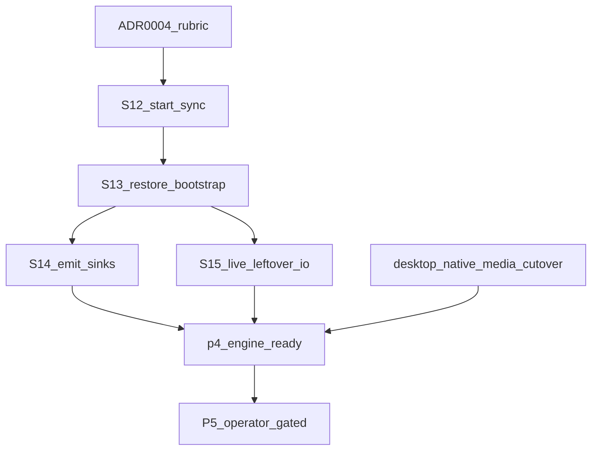

# 13 — Language-boundary goal graph (loop operator)

This is the loop that finishes the work [ADR 0004](../adr/0004-rust-language-boundaries.md)
named. It does **not** replace the implementer playbook. It tells the next
turn which node to run.

**How to pick the next slice:** playbook section 5, then this graph.
**What done means:** playbook section 12, minus P5 (operator/Apple gated).
**What may be written in Rust:** ADR 0004.

GitHub Actions minutes are exhausted. Verify locally (`cargo test` when
disk ≥ 20 Gi). Delay Actions. Do not treat a skipped Actions run as
failure.

---

## Goal

iOS and desktop share one live `synara-core` engine for session, sync,
room list, timeline, and crypto. Native media is the sole decrypt path.
UI, Keychain, APNs, NSE lifecycle, and Node scripts stay put.

This goal is **not** P5, not a release, not a Slint/Dioxus/egui rewrite,
and not Tauri iOS.

---

## Loop

```text
1. Read this file + playbook §5.
2. Take the first node whose status is `next`.
3. Implement one slice. Local tests. Commit. Push. Open or update the PR.
4. Mark that node `landed` or `in-pr`. Set the following node to `next`.
5. Repeat until every `required` node is `landed` or `blocked`.
6. Stop on `blocked` (P5, Apple generate, live homeserver, merge).
```

Do not invent 7B leftovers. Do not start P5. Do not claim iOS-on-engine
until S13–S15 are landed and a live session actually syncs.

---

## Graph



| Node | Status | Kind | Slice |
|---|---|---|---|
| ADR 0004 rubric | `in-pr` #1000 | required docs | Can/should filter. No UI/CI rewrite. |
| P4-S12 start_sync | `in-pr` #1001 | required | Start already-attached SyncService. NSE still cannot start. |
| P4-S13 restore bootstrap | `in-pr` #1001 | required | Cold-start: restore vault session → attach → start. One product path with login. |
| P4-S14 emit sinks | `in-pr` #1001 | required | Timeline view-delta poll queue. Summaries only. NSE cannot poll. Other product emits stay no-op. |
| P4-S15 leftover I/O live | next | required | Planted leftover I/O that needs a live homeserver stays fail-closed until a written owner decision. Prefer status/recover that already have Core owners. No byte/secret envelopes. |
| Desktop native media cutover | pending | required | Retire `browser-encrypt-attachment` and shrink `synara/src/sw.ts` once both shells get bytes from the native owner. Do not register `matrix_send_attachment` on Core. |
| P4 engine ready | pending | gate | Session + sync + room list + timeline + crypto product paths call Core on iOS. Not claimed. |
| P5 | `blocked` | operator | Do not start. Apple/TestFlight/physical-device. |

---

## Current pointer

**S14 is on #1001 with S12 and S13.** Timeline view-delta is the first
emit family. After that PR merges: set S15 `next` if not already
started. Do not start P5. Next implementer: leftover I/O (S15) or
desktop native media cutover.

---

## Stop conditions

- Disk under 20 Gi and the slice needs cargo/UniFFI.
- The next node is P5.
- A leftover secret/byte command would have to cross `Core::command`.
- The only remaining work is Apple generate, a live homeserver, or a merge.
