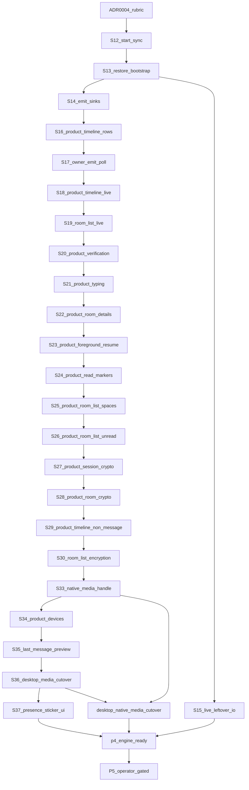

# 13 — Language-boundary goal graph (loop operator)

This is the loop that finishes the work [ADR 0004](../adr/0004-rust-language-boundaries.md)
named. It does **not** replace the implementer playbook. It tells the next
turn which node to run.

**How to pick the next slice:** playbook section 5, then this graph.
**What done means:** playbook section 12, minus P5 (operator/Apple gated).
**What may be written in Rust:** ADR 0004.

GitHub Actions minutes are exhausted. Verify locally (`cargo test` when
disk ≥ 20 Gi). Delay Actions. Do not treat a skipped Actions run as
failure.

---

## Goal

iOS and desktop share one live `synara-core` engine for session, sync,
room list, timeline, and crypto. Native media is the sole decrypt path.
UI, Keychain, APNs, NSE lifecycle, and Node scripts stay put.

This goal is **not** P5, not a release, not a Slint/Dioxus/egui rewrite,
and not Tauri iOS.

---

## Loop

```text
1. Read this file + playbook §5.
2. Take the first node whose status is `next`.
3. Implement one slice. Local tests. Commit. Push. Open or update the PR.
4. Mark that node `landed` or `in-pr`. Set the following node to `next`.
5. Repeat until every `required` node is `landed` or `blocked`.
6. Stop on `blocked` (P5, Apple generate, live homeserver, merge).
```

Do not invent 7B leftovers. Do not start P5. Do not claim iOS-on-engine
until S13–S15 are landed and a live session actually syncs.

---

## Graph



| Node | Status | Kind | Slice |
|---|---|---|---|
| ADR 0004 rubric | `in-pr` #1000 | required docs | Can/should filter. No UI/CI rewrite. |
| P4-S12 start_sync | `in-pr` #1001 | required | Start already-attached SyncService. NSE still cannot start. |
| P4-S13 restore bootstrap | `in-pr` #1001 | required | Cold-start: restore vault session → attach → start. One product path with login. |
| P4-S14 emit sinks | `in-pr` #1001 | required | Timeline view-delta poll queue. Summaries only. NSE cannot poll. Product consume is S18. |
| P4-S15 leftover I/O live | `in-pr` #1001 | required | Owner leftover status after attach. Recover/media/raw-send stay fail-closed (decision 15). No byte/secret envelopes. |
| P4-S16 product timeline rows | `in-pr` #1001 | required | Snapshot DTO keeps privacy-safe row bodies. Product maps them. No media bytes. |
| P4-S17 owner emit poll | `in-pr` #1001 | required | Presence/devices/join_rules/image_packs poll queue. Summaries only. NSE cannot poll. |
| P4-S18 product timeline live poll | `in-pr` #1001 | required | Product `timelineUpdates` consumes S14 summaries. One host poller. |
| P4-S19 room-list live poll | `in-pr` #1001 | required | After start_sync, wake-ups only. Product `roomUpdates` re-fetches snapshot. No room ids. |
| P4-S20 product verification | `in-pr` #1001 | required | Product crypto calls list/SAS. `verification` family on the S17 owner queue. |
| P4-S21 product typing live | `in-pr` #1001 | required | `typing` family on the S17 owner queue (room id only). Product `typingUsers` re-fetches snapshot. |
| P4-S22 product room details | `in-pr` #1001 | required | Product `roomDetails` maps list / members / power / join-rule / invite snapshots. No media bytes. |
| P4-S23 product foreground resume | `in-pr` #1001 | required | `resumeFromForeground` uses the S13 bootstrap. Second start is a restart. No NSE. |
| P4-S24 product read markers | `in-pr` #1001 | required | Product mark-as-read uses `timeline_set_read_state`. No HTTP access token. |
| P4-S25 product room-list spaces/invites | `in-pr` #1001 | required | Product `loadRooms` maps space parents and invite previews. Joined last-message stays empty. |
| P4-S26 product room-list unread lookup | `in-pr` #1001 | required | Product `hasUnreadMessages` uses the cached snapshot. Agent rooms stay false. |
| P4-S27 product session crypto status | `in-pr` #1001 | required | Product `sessionStatus` maps leftover backup/crypto and secret-storage. No recovery keys. |
| P4-S28 product room crypto status | `in-pr` #1001 | required | Product `roomStatus` reuses the S27 mapper plus invite encryption. Joined-room encryption stays unknown. |
| P4-S29 product timeline non-message rows | `in-pr` #1001 | required | Poll / membership / state / call bodies already on the row DTO map to text. No media bytes. |
| P4-S30 room-list encryption + notify mode | `in-pr` #1001 | required | UniFFI keeps Core `is_encrypted` / `notification_mode`. Product roomStatus / details consume them. |
| P4-S31–S33 reactions + media handle | `in-pr` #1001 | required | Row DTO keeps reaction counts and opaque handles. `timeline_media_bytes` is UniFFI bytes, not `Core.command`. |
| P4-S34 product device list | `in-pr` #1001 | required | Settings lists device snapshot display names. No keys. |
| P4-S35 last-message preview | `in-pr` #1001 | required | Core/UniFFI project a privacy-safe last-message preview. Product room lists consume it. |
| P4-S36 desktop media handle cutover | `in-pr` #1001 | required | Leftover `matrix_media_download` resolves `timeline-media-*` through the native owner. Not `Core.command`. |
| P4-S37 presence + sticker pack UI | `in-pr` #1001 | required | Settings/room details consume presence. Composer lists image-pack names and sends via `SharedCoreSendSticker`. |
| Desktop native media cutover | `in-pr` #1001 | required | Live timeline uses `synara-media://` + handle resolve. Leftover `mxc://` is avatar/pack only. |
| P4 engine ready | pending | gate | Session + sync + room list + timeline + crypto product paths call Core on iOS. Not claimed. |
| P5 | `blocked` | operator | Do not start. Apple/TestFlight/physical-device. |

---

## Current pointer

**S12–S37 are on #1001.** Session, sync, room list, timeline,
verification, typing, room-details, read-marker, crypto, reactions,
opaque media handles, last-message previews, Settings devices,
presence, and sticker-pack UI call Core. Desktop live media uses
the handle owner. Do not start P5. Do not claim P4 engine ready.
Apple generate is required for the new UniFFI fields.

---

## Stop conditions

- Disk under 20 Gi and the slice needs cargo/UniFFI.
- The next node is P5.
- A leftover secret/byte command would have to cross `Core::command`.
- The only remaining work is Apple generate, a live homeserver, or a merge.
